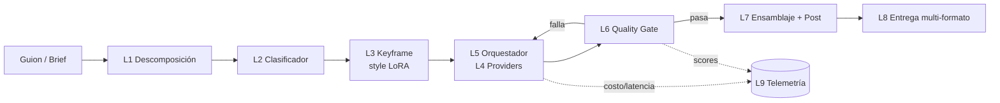
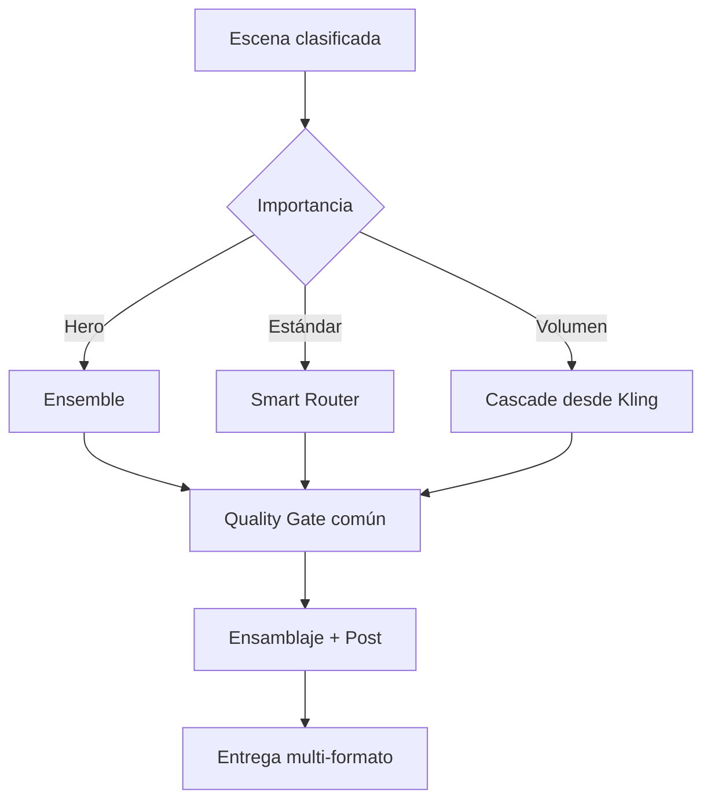

# SPEC — Industrialización de Video con IA (Multi-modelo, API-only)

> **Caso ancla:** video estilo **LEGO**. Diseñado para generalizar a cualquier estilo
> (sci-fi, claymation, anime, producto…) intercambiando el *style slot* sin tocar la
> orquestación.
>
> **Enfoque:** solo API (sin self-hosting en MVP), priorizando ahorro y mezcla de modelos.
>
> **Estado:** v0.2 — este documento describe **arquitectura y contratos**. El *por qué* de cada
> elección (con estado y "qué cambió") vive en el registro de decisiones: **[`docs/decisiones/`](docs/decisiones/)**.
> Revalidar precios de cada API antes de cerrar presupuesto.

---

## 0. Resumen ejecutivo

Pipeline que convierte un **brief/guion** en un **video multi-formato** atravesando 10 capas
desacopladas por contratos tipados. El núcleo es **Python + asyncio** orquestando varios
modelos de video por API a través de una **interfaz `Provider` única**, con un **Quality Gate
común** y **telemetría de costo/latencia por escena desde el día 1**.

**Insight central:** el cuello de botella no es el modelo, es (a) la **consistencia entre tomas**
y (b) el **control de costo por escena**. Toda la arquitectura gira en torno a un
**clasificador de escenas + quality gate**, y a enrutar cada escena al modelo más barato que
cumpla el requisito.

**Decisión técnica más importante:** en API-only el **LoRA de estilo no vive en el modelo de
video** (Veo/Kling/Seedance no aceptan pesos custom). Vive en una **etapa de imagen previa**
(Flux + LoRA) que genera un *keyframe* de estilo, el cual se inyecta como `init_image` a los
modelos **image-to-video**. Esto añade la capa L3 (Keyframe) y es lo que da el look LEGO + la
consistencia.

---

## 1. Arquitectura por capas

Cada capa expone un **contrato** (entrada → salida tipada). Esto permite construir un MVP como
*slice vertical* delgado y engordar cada capa después sin reescribir.

```
L0  Contracts & Config      ── modelos de datos (Pydantic), config, style registry
L1  Ingest / Scene Decomp   ── brief/guion → lista de escenas estructuradas
L2  Scene Classifier        ── etiqueta hero | estándar | volumen (+ requisitos)
L3  Keyframe Stage          ── escena → imagen de estilo (style LoRA por API)
L4  Provider Adapter        ── 1 interfaz, N backends (Kling/Seedance/Veo/fal...)
L5  Orchestrator            ── router | cascade | ensemble según clasificación
L6  Quality Gate            ── Claude visión (fusión de señales), umbral por clase; suave por defecto
L7  Assembly & Post         ── banda sonora (voz TTS + SFX/ambiente V2A MMAudio + música) + captions (ffmpeg), concat
L8  Delivery                ── render multi-formato (9:16 / 1:1 / 16:9)
L9  Observability           ── costo y latencia por escena
L10 Edición autónoma        ── describe (Haiku, ojos) + graphics (movis) + mcp-video (montaje); sin editora
```

> **Modo interactivo (AI-in-the-Loop, [D-021]/[D-022]):** sobre estas capas hay **checkpoints
> humanos**. El humano elige la **cara del personaje** (`cast`/`pick-cast`, L3) y el **keyframe**
> por escena (`keyframes`/`pick`, L3) entre N candidatos; la IA genera y el Gate **ordena** los
> candidatos. El modo **autónomo** (`run`) sigue existiendo. Ver §7 (proyecto/estado) y `studio.py`.
>
> **Entrega para edición humana (L8, [D-029]):** el último checkpoint es la editora. `pipeline
> export <slug>` arma `projects/<slug>/export/` con la materia prima limpia: `media/` (videos sin
> texto/voz quemada + voces + música, emparejados por `NN_<id>`), `frames/` (keyframes), `rough_cut.mp4`
> (referencia de orden), `subtitulos.srt` y `guion.md` (onboarding + tabla de planos). El `final.mp4`
> del run es el rough cut, no el definitivo.
>
> **Edición autónoma (L10, [D-041]/[D-042]):** cuando **no hay editora**, un agente (Opus) cierra
> el corte priorizando **el mensaje sobre el pulido**. Tres piezas con roles separados: **`pipeline
> describe`** = los *ojos* (Claude **Haiku** describe/evalúa cada plano → `descriptions.yaml`:
> usable / en-mensaje / roto); **`pipeline graphics`** = el *artista* (**movis** genera motion
> graphics deterministas — lower-thirds, placas — a `export/graphics/`, por el CLI); y **mcp-video**
> = el *ingeniero* (servidor **MCP** guardrailed que el agente usa directo para montar: trim/merge/
> overlay/subtítulos/normalize/mix/checkpoint/export → `final_cut.mp4`). **Sin EDL propio**: la
> reproducibilidad la dan los receipts de mcp-video + los artefactos deterministas. La excepción a
> "CLI = contrato" (mcp-video entra directo, acotado a edición) está justificada en [D-042].
>
> **El CLI es un contrato dual-audiencia ([D-023]):** la misma superficie la consumen humanos y
> agentes (opencode, claude code). Por eso el CLI es **auto-descriptivo** (`--list`/`--help`,
> listar ids/escenas sin llamar a modelos), expone **estado legible por máquina**
> (`selections.yaml`/manifiesto, no prosa), y da **errores con exit codes claros**, idempotencia y
> `--dry-run`. Encima vive una capa de **skills** (`skills/<nombre>/SKILL.md`): guías markdown que
> apuntan a **subcomandos del CLI, no a clases internas**, y se versionan con el repo. Un **smoke de
> contrato en CI** ejecuta las invocaciones que cada skill menciona para que el drift falle ruidoso
> en vez de pudrir la skill en silencio. Ver [D-023] y `skills/`.



---

## 2. Contratos (L0) — el corazón del SPEC

Los tipos que viajan entre capas. Son la inversión que paga todo: fijarlos primero evita
reescribir cuando entren nuevas estrategias o proveedores.

```python
from pydantic import BaseModel
from pathlib import Path
from typing import Literal, Protocol

# --- Requisitos y escena ---------------------------------------------------
class SceneRequirements(BaseModel):
    needs_audio: bool = False        # diálogo sincronizado → dispara Veo
    needs_lipsync: bool = False
    needs_4k: bool = False
    needs_camera_control: bool = False
    needs_hdr: bool = False

class Shot(BaseModel):                          # plano (D-028): unidad atómica keyframe+clip+audio
    framing: str                               # encuadre/acción que EXTIENDE el prompt de la escena
    duration_s: float
    seed: int = 0                              # reroll del plano (cache miss solo en este plano)
    voiceover: str | None = None               # audio del plano (TTS)
    caption: str | None = None                 # texto en pantalla del plano
    sfx: str | None = None                     # efectos de sonido de la acción (V2A MMAudio, D-034)
    keyframe: Path | None = None               # rellenado por L3

class Scene(BaseModel):                         # beat (D-028): agrupa planos; comparte prompt+personajes
    id: str
    prompt: str                                # BASE (setting+personajes); el plano le suma el framing
    duration_s: float
    characters: list[str] = []                 # para consistencia entre tomas
    dialogue: str | None = None
    class_: Literal["hero", "standard", "volume"] | None = None
    requirements: SceneRequirements = SceneRequirements()
    shots: list[Shot] = []                      # planos (D-028); vacío = 1 plano implícito (compat)
    keyframe: Path | None = None               # rellenado por L3 (plano 1 = keyframe elegido)
    seed: int = 0                              # reroll: subirlo regenera SOLO esta escena
    ambience: str | None = None                # sonido del lugar (V2A MMAudio, por escena, D-034)
    character_refs: list[Path] = []            # transitorio: refs resueltas por el runner

# Plano 1 = el keyframe que elige el humano (best-of-N, por escena); planos 2+ se autogeneran
# en el render (n=1, sin validación). El flujo interactivo sigue scene-addressed. Ver D-028.

# --- Contrato de generación (lo que ve CUALQUIER provider) -----------------
class GenRequest(BaseModel):
    prompt: str
    duration_s: float
    aspect_ratio: str = "9:16"
    init_image: Path | None = None             # keyframe de estilo (image-to-video)
    ref_images: list[Path] = []                # consistencia de personaje
    seed: int | None = None

class GenResult(BaseModel):
    video_path: Path
    provider: str
    cost_usd: float                            # ← telemetría día 1
    latency_s: float
    raw_meta: dict = {}

# --- Quality Gate ----------------------------------------------------------
class GateReport(BaseModel):
    passed: bool
    aesthetic: float = 0.0
    char_consistency: float = 0.0
    clip_adherence: float = 0.0
    artifacts: float = 0.0                      # 0 = limpio, 1 = roto
    reason: str = ""
```

### Interfaces (Protocols)

```python
class Provider(Protocol):
    name: str
    cost_per_second: float
    capabilities: set[str]   # {"audio","4k","lipsync","i2v","camera","hdr"}
    async def generate(self, req: GenRequest) -> GenResult: ...

class QualityGate(Protocol):
    async def evaluate(self, scene: Scene, result: GenResult) -> GateReport: ...

class Strategy(Protocol):
    async def run(self, scene: Scene, providers: list[Provider],
                  gate: QualityGate) -> GenResult: ...
```

Router, Cascade y Ensemble son **3 implementaciones de `Strategy`** sobre la misma lista de
`Provider`. No tocan nada más. El híbrido (§5) se resuelve por tabla de config, sin código.

---

## 3. Decisiones de tecnología

El *por qué* de cada elección vive en el **registro de decisiones** (ADR), numerado y con estado:
**[`docs/decisiones/`](docs/decisiones/)**. Resumen de la cadena por capa (ver el ADR para alternativas y
trade-offs):

| Capa / tema | Elección | ADR |
|---|---|---|
| Orquestación | Python + asyncio | [D-001](docs/decisiones/0001-0010.md) |
| Acceso a modelos | Agregador fal.ai (+ directos a volumen) | [D-002](docs/decisiones/0001-0010.md) |
| L3 Estilo/keyframe | LoRA en la imagen (Flux), no en el video | [D-003](docs/decisiones/0001-0010.md) |
| L4 Video por tier | Kling / Seedance / Veo | [D-004](docs/decisiones/0001-0010.md), [D-020](docs/decisiones/0011-0020.md) |
| L2 Clasificador | Reglas + Claude (híbrido) | [D-005](docs/decisiones/0001-0010.md) |
| L5 Estrategias | Router / Cascade / Ensemble (híbrido por YAML) | [D-006](docs/decisiones/0001-0010.md) |
| L6 Quality Gate | VLM-judge → señales enchufables + fusión | [D-007](docs/decisiones/0001-0010.md), [D-016](docs/decisiones/0011-0020.md) |
| L7/L8 Post | ffmpeg | [D-008](docs/decisiones/0001-0010.md) |
| L9 Estado/cola | SQLite+asyncio → Temporal+Postgres | [D-009](docs/decisiones/0001-0010.md) |
| Modelo de proyecto | Spec + caché content-addressed + runs | [D-013](docs/decisiones/0011-0020.md)…[D-015](docs/decisiones/0011-0020.md) |
| Filosofía de deps | APIs antes que libs pesadas | [D-017](docs/decisiones/0011-0020.md) |
| Consistencia de personaje | API-first (nano-banana + Claude visión) | [D-019](docs/decisiones/0011-0020.md) |
| Tooling | uv · pydantic-settings · TDD selectivo | [D-010](docs/decisiones/0001-0010.md), [D-011](docs/decisiones/0011-0020.md), [D-012](docs/decisiones/0011-0020.md) |

---

## 4. Estrategias de orquestación (L5)

### 4.1 Smart Cost Router (default de producción)
Clasifica la escena y la despacha **en un solo paso** al modelo más barato que cumpla el
requisito. Latencia y costo predecibles. Depende de un clasificador bien calibrado.

### 4.2 Cascade Fallback (volumen "good enough")
Intenta **siempre primero el más barato**; si el gate falla, escala de tier en tier hasta
aprobar, y como último recurso a cola humana. No depende de clasificador fino. Costo/latencia
variables.

### 4.3 Parallel Ensemble / Best-of-N (hero / marca)
Genera **N candidatos en paralelo** entre varios modelos, los puntúa y elige el mejor. Máxima
calidad, el más caro. Reservado a un % bajo de escenas.

### 4.4 Híbrido por defecto (recomendado)
| Importancia | % aprox. | Estrategia |
|---|---|---|
| Hero / marca | 5–10% | Ensemble |
| Estándar | 60–70% | Smart Router |
| Volumen / relleno | 20–30% | Cascade desde Kling |

Una **sola capa de Quality Gate y de post** para todas; lo que cambia es la estrategia.



---

## 5. Quality Gate (L6)

Combina señales y compara contra un **umbral por tipo de escena** (hero más estricto que
volumen).

Arquitectura de **señales enchufables** (`gate/`): cada señal puntúa un frame del clip; se
**fusionan ponderado** y se comparan contra el umbral de la clase.

| Señal | Tecnología | Estado |
|---|---|---|
| Adherencia semántica + artefactos + "¿se ve LEGO?" | **VLM-judge (Claude visión, multimodal)** | ✅ **default** |
| Adherencia prompt↔frame numérica | CLIP (open_clip) | implementada, **dormida** (extra `[vision]`) |
| Score estético | Aesthetic scorer (LAION) | implementada, **dormida** (extra `[vision]`) |
| Consistencia de personaje (embedding) | insightface / ArcFace | Sprint 4 |
| Artefactos temporales (flicker/warp) | Modelo especializado | Sprint 4+ |

> **Decisión (Sprint 3):** el proyecto prefiere **gastar en APIs antes que librerías pesadas**
> (torch). Por eso el gate por defecto usa **solo Claude visión** (multimodal, sin torch);
> CLIP/aesthetic quedan tras el extra opcional `[vision]` por si algún día se juzga a volumen
> enorme (donde lo determinista y gratis-por-llamada gana). Auto-captions: vía **API de
> transcripción**, no whisper local.

**Modo del gate:** `enforce` en `routing.yaml`. **Suave por defecto** (`enforce: false`): puntúa
y registra los scores pero **no bloquea** (no dispara regeneraciones caras mientras se itera).
En estricto: en fallo → reintento / escalado de tier (según estrategia) y, último recurso,
**cola humana**. Los scores suaves alimentan la calibración futura de umbrales.

---

## 6. Plan de entrega por capas

### MVP (hoy) — slice vertical
`brief → un video LEGO ensamblado`, atravesando todas las capas en su versión mínima. Lo que
importa es **fijar los contratos**; el músculo se añade después.

| Capa | Versión MVP | Se difiere |
|---|---|---|
| L0 Contracts | Completo (Pydantic) | — |
| L1 Decomp | Claude: guion → `list[Scene]` | edición humana de escenas |
| L2 Classifier | Reglas + Claude | calibración fina / entrenado |
| L3 Keyframe | Flux + LEGO LoRA (fal) → 1 img/escena | banco de personajes, multi-ref |
| L4 Adapter | **1 provider: Kling** (i2v) vía fal | Seedance, Veo, Runway, Luma |
| L5 Orchestrator | **solo Smart Router** | cascade + ensemble |
| L6 Gate | **VLM-judge** pasa/falla + 1 reintento | CLIP/insightface/aesthetic |
| L7 Assembly | ffmpeg concat + música + captions | color grade, transiciones, Remotion |
| L8 Delivery | 1 formato **9:16** | 1:1 y 16:9 |
| L9 Observability | log `cost_usd`+`latency_s` → SQLite | dashboard |

El MVP se construyó así (histórico). Hoy el comando vive sobre un **proyecto** (ver README/§7):
```bash
uv run pipeline run lego_demo                      # autónomo, con caché
uv run pipeline run --brief briefs/example.yaml    # smoke suelto a out/ (sin proyecto)
```

**Orden de construcción (MVP):** `contracts` → `telemetry` → adapter `fal_kling` → `keyframe` →
`router` → `gate` → `assemble` → `cli`.

### Roadmap
El plan vivo, con estado por sprint, vive en **[`ROADMAP.md`](ROADMAP.md)** (fuente canónica).
Resumen al día: Sprints 1–4.6 cerrados (MVP → caché/proyecto → multi-modelo → gate duro →
consistencia → checkpoints interactivos casting+keyframe). **Siguiente: Sprint 5 — Producción
mínima** (música + captions por escena + robustez). Luego: audio/voz ElevenLabs (6), escala/ops (7),
internalización (8).

---

## 7. Modelo de proyecto, iteración y caché

> Decisión de diseño (Sprint 1.5). El cuello de botella al iterar **no es el orden en disco,
> es el costo**: cada paso de generación cuesta dinero. El modelo combina **spec declarativo +
> caché content-addressed + runs inmutables como manifiesto**. Granularidad de iteración =
> **escena**. Alcance actual = **1 estilo/marca** (sin herencia multi-marca).

### 7.1 El proyecto es un spec declarativo (`project.yaml`)

El proyecto ES su spec versionado en git. El pipeline es una **función pura del spec**: mismo
spec → mismos hashes → mismos artefactos (de caché). `project.yaml` es la **entrada única**:

```yaml
project: lego_demo
style: lego                 # referencia a config/styles/<style>.yaml
format: "9:16"
overrides:                  # opcional: pisar config global para este proyecto
  providers: {}
scenes:
  - id: s1
    prompt: "Plano general de una ciudad LEGO al amanecer, calles vacias"
    duration_s: 5
    seed: 0                 # subir el seed = "reroll" (nueva variante de ESTA escena)
  - id: s2
    prompt: "Dos minifiguras LEGO conversan en una cafeteria, plano medio"
    duration_s: 5
    dialogue: "Hoy lanzamos el producto."
    seed: 0
```

### 7.2 Caché content-addressed (lo que corta el costo de iterar)

Cada paso de cada escena se llavea por el **hash de sus inputs**. Si el hash ya existe en caché,
se reutiliza con **costo $0**.

```
keyframe_key = hash(scene.prompt + style.template + style.negative + kf.model + kf.lora + strength)
video_key    = hash(keyframe_key + provider + provider.model + duration + aspect_ratio + seed)
```

- Cambias el prompt de la escena 3 → cambia su `keyframe_key` → **solo** se regenera la 3.
- Escenas sin cambios → mismo hash → **cache hit**.
- **Seed determinista por defecto** (si no se rerollea): re-correr el proyecto = todo cache hit.
  Para pedir otra variante de una escena, se **sube su `seed`** (reroll intencional) → cache miss
  solo en esa escena.

El caché vive **a nivel proyecto** (`projects/<slug>/cache/`), compartido entre todos sus runs.

### 7.3 Runs inmutables como manifiesto

Un run es una **materialización** del spec: un manifiesto con la config resuelta y **punteros**
(`keyframe_key`, `video_key`) por escena, más el render final. Como los artefactos son inmutables
por hash, los runs son baratos y **comparar dos iteraciones = diff de manifiestos**.

```
projects/<slug>/
  project.yaml                    # 7.1 — spec versionado (entrada única)
  cache/
    keyframes/<keyframe_key>.png  # 7.2 — inmutables, compartidos entre runs (verdad del caché)
    clips/<video_key>.mp4
  keyframes/                      # 7.6 — alias humano-facing con nombre legible (D-026)
    s1_<slug>_0.png               #        copia/alias del artefacto cacheado por hash
  runs/<run_id>/
    manifest.yaml                 # 7.3 — config resuelta + punteros por escena
    run_report.json               # costo/latencia + cuáles fueron cache hit
    final_9x16.mp4
```

### 7.4 Modelo de datos (`project.py`)

- `Project` — resuelve `project.yaml`, conoce sus paths de `cache/` y `runs/`, su estilo único.
- `Run` — `run_id`, manifiesto, escribe todas sus salidas dentro de `runs/<run_id>/`.
- `cache_key(step, inputs)` + `cache_lookup / cache_store` — **lógica pura** (core testeable 🔬).

### 7.5 Impacto en las capas existentes

- **L3/L4** (keyframe, providers) dejan de escribir en `out/` plano → leen/escriben el **caché por
  hash**; si hay hit, no hay llamada a la API (costo 0).
- **L9** (telemetry) escribe en `runs/<run_id>/`; `SceneRecord` gana `cached: bool` + las keys.
- **CLI**: entrada nueva `pipeline run <project>` (lee `project.yaml`); `--brief` se mantiene para smokes.
- **CLI ([D-025])**: `render` gana `--keyframe <escena>=<ruta>` (repetible) para inyectar el keyframe
  directo, con precedencia sobre `selections.yaml`. El flag se refleja en `skills/*` y lo cubre el
  test de contrato ([D-023]).

### 7.6 Artefactos legibles + inyección directa (AI-in-the-Loop, D-025/D-026)

El humano **mira, elige y manipula** los artefactos ([D-021]), así que la capa visible necesita ser
legible y tomable a mano:

- **Nombre semántico ([D-026]):** los keyframes/caras candidatos se exponen con un nombre legible
  (`<escena>_<slug>_<idx>.png`, `<personaje>_cara_<idx>.png`). El **hash sigue siendo la verdad del
  caché** (`cache/<categoría>/<key>.png`); el nombre legible es un **alias humano-facing**, no un
  reemplazo. El slug se deriva con Claude (modelo más barato); sin `ANTHROPIC_API_KEY` cae al `id`.
- **Inyección directa ([D-025]):** cuando el humano **ya tiene** la imagen, `render` la toma por
  flag sin pasar por el ciclo de candidatos: `pipeline render <slug> --keyframe s1=ruta` (repetible).
  El flag **gana** sobre `selections.yaml` para esa escena; el resto usa la selección persistida.

---

## 8. Estructura del repositorio

```
video_gen_pipeline/
├─ SPEC.md
├─ pyproject.toml
├─ .mcp.json               # registra mcp-video (MCP, vía uvx) para edición autónoma ([D-042])
├─ config/
│  ├─ providers.yaml        # costo/seg, capabilities por backend
│  ├─ routing.yaml          # escena→estrategia→provider + umbrales + enforce (gate)
│  └─ styles/lego.yaml      # prompt template, negative, keyframe model + ref_model
├─ src/pipeline/
│  ├─ contracts.py          # L0 — tipos entre capas
│  ├─ config.py             # L0 — carga/validación de YAML
│  ├─ settings.py           # secretos (pydantic-settings, .env)
│  ├─ ingest.py             # L1
│  ├─ classifier.py         # L2
│  ├─ keyframe.py           # L3 (Flux text2img + nano-banana edit con referencia)
│  ├─ providers/            # L4 — base.py (Protocol), fal_kling.py, google_veo.py
│  ├─ strategies/           # L5 — router, cascade, ensemble, dispatch (híbrido), common
│  ├─ gate/                 # L6 — fusion, frames, vlm, identity, clip*, aesthetic*, fused
│  ├─ assemble.py           # L7
│  ├─ post.py               # L7 — lower-thirds de marca (ffmpeg drawtext)
│  ├─ deliver.py            # L8
│  ├─ export.py             # L8 — bundle para edición ([D-029])
│  ├─ describe.py           # L10 — ojos: Haiku describe/evalúa cada plano ([D-041])
│  ├─ graphics.py           # L10 — artista: motion graphics con movis ([D-042])
│  ├─ telemetry.py          # L9
│  ├─ project.py            # §7 proyecto + caché + banco de personajes/casting
│  ├─ runner.py             # orquesta una corrida (keyframe→video→gate→ensamblaje)
│  ├─ studio.py             # modo interactivo: cast / pick-cast / keyframes / pick / render
│  ├─ contact_sheet.py      # hoja de contactos HTML (elegir candidatos)
│  └─ cli.py
├─ skills/<nombre>/SKILL.md # capa de discoverability para agentes ([D-023]); apunta al CLI
├─ briefs/example.yaml      # modo --brief (smoke suelto)
├─ projects/<slug>/         # §7 — project.yaml (trackeado) + cache/ + runs/ (gitignored)
└─ out/                     # scratch del modo --brief
```
> `gate/clip.py` y `gate/aesthetic.py` están **dormidas** (extra `[vision]`, torch); el gate por
> defecto usa solo Claude visión ([D-017]).
> `graphics.py` (motion graphics, movis) vive tras el extra `[edit]`; **mcp-video** no es dependencia
> del proyecto: corre por `uvx` desde `.mcp.json` (env liviano, sin torch/whisper). Ver [D-042].

---

## 9. Config de referencia (borrador)

`config/providers.yaml`
```yaml
providers:
  kling:
    backend: fal
    model: "fal-ai/kling-video/v3/image-to-video"
    cost_per_second: 0.03
    capabilities: [i2v, lipsync, 4k]
  seedance:
    backend: fal
    model: "fal-ai/bytedance/seedance/v2"
    cost_per_second: 0.06
    capabilities: [i2v, multishot]
  veo:
    backend: google
    model: "veo-3.1"
    cost_per_second: 0.50
    capabilities: [audio, lipsync, i2v]
```

`config/routing.yaml`
```yaml
hybrid:
  hero:     { strategy: ensemble, providers: [veo, seedance, kling] }
  standard: { strategy: router,   providers: [seedance, kling] }
  volume:   { strategy: cascade,  providers: [kling, seedance, veo] }
thresholds:
  hero:     { aesthetic: 0.80, char_consistency: 0.85, clip_adherence: 0.75 }
  standard: { aesthetic: 0.65, char_consistency: 0.70, clip_adherence: 0.65 }
  volume:   { aesthetic: 0.50, char_consistency: 0.55, clip_adherence: 0.55 }
```

`config/styles/lego.yaml`
```yaml
style: lego
keyframe:
  backend: fal
  model: "fal-ai/flux-lora"
  lora: "<url-o-id-del-lora-lego>"
  strength: 0.9
prompt_template: >
  {scene_prompt}, LEGO brick style, plastic minifigure characters, studio lighting,
  shallow depth of field, highly detailed, toy photography
negative_prompt: "realistic skin, photorealism, blur, deformed bricks"
```

---

## 10. Cifras de referencia (Jun 2026 — revalidar)

| Modelo | Rol | Costo aprox. |
|---|---|---|
| Veo 3.1 | Hero + audio | Premium |
| Seedance 2.0 | Multi-shot consistencia | Freemium |
| Kling 3.0 | Volumen / B-roll | ~$0.03/s (~$0.50/clip) |
| Runway Gen-4.5 | Control de cámara | Desde $12/mes |
| Luma Ray3 | HDR | Desde $7.99/mes |

- Ahorro multi-modelo estimado: **60–70%** vs. premium-only.
- LoRA de estilo/personaje: 20–50 imgs (estilo), 80–120 (sujeto específico).
- ⚠️ **Sora deprecado** (26-abr-2026, API off 24-sep-2026): no construir encima.

---

_v0.1 — documento vivo. Cada decisión de §3 se loguea y recalibra con la telemetría de L9._
