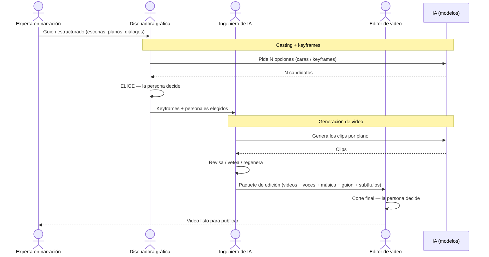

# Cómo trabajamos: el equipo + la IA

*Una página para que todo el equipo sepa quién hace qué, en qué orden, y dónde entra la IA.*

## Para qué es este documento

Producir video **rápido y consistente** sin perder el control humano. Cuatro personas,
un flujo claro, la IA como herramienta en el medio. Léelo una vez y sabrás dónde encajás.

## La regla de oro

> La IA **genera opciones**; las **personas deciden**. Nadie le delega la responsabilidad a la IA:
> la usamos como una herramienta más. En cada paso donde la IA produce algo, **un humano elige y
> aprueba**. Si una pieza sale al mundo, es porque una persona la aprobó.
>
> Eso es **AI-in-the-Loop**: la persona está siempre dentro del ciclo. La IA nunca firma — nosotros sí.

## El equipo

| Rol | Qué aporta |
|---|---|
| **Experta en narración** | El guion: la historia, las escenas, los diálogos. |
| **Diseñadora gráfica** | Los insumos visuales clave: personajes, símbolos, keyframes (a mano o con IA). |
| **Ingeniero de IA** | Convierte los keyframes en video usando los modelos. |
| **Editor de video** | Arma el corte final con todo el material. |

## El flujo (diagrama de secuencia)

## Paso a paso

### 1. Experta en narración — *el guion*

- **Recibe:** un tema o un brief.
- **Hace:** escribe el guion **estructurado** — la historia partida en **escenas** (momentos) y cada
  escena en **planos** (tomas), con el **diálogo o la voz en off** de cada plano y una idea del
  encuadre ("plano abierto de la plaza", "primer plano de la mano").
- **Entrega:** el guion estructurado a la diseñadora.

### 2. Diseñadora gráfica — *los insumos visuales clave*

- **Recibe:** el guion.
- **Hace:** define el **look** y los **personajes**. Crea los insumos clave —caras de personaje,
  símbolos, **keyframes** (la imagen base de cada plano)— a mano **o pidiéndole a la IA varias
  opciones**. La IA tira N candidatos; **ella elige** el que sirve (casting y keyframe).
- **Entrega:** los **keyframes y personajes elegidos** al ingeniero.
- **Aquí decide un humano:** la cara del personaje y la imagen base de cada plano.

### 3. Ingeniero de IA — *de imagen a video*

- **Recibe:** los keyframes elegidos.
- **Hace:** corre los **modelos de video** que animan cada keyframe en un clip por plano. **Revisa**
  el resultado: si un plano salió mal, lo **vetea y regenera**.
- **Entrega:** el **paquete de edición** a la editora — videos limpios, voces, música, el guion y los
  subtítulos, todo ordenado y a la mano.
- **Aquí decide un humano:** qué clip pasa y cuál se regenera.

### 4. Editor de video — *el corte final*

- **Recibe:** el paquete de edición.
- **Hace:** el **corte definitivo** — ritmo, transiciones, texto en pantalla, mezcla de voz y música.
  El video auto-armado es solo una **referencia** del orden; el corte real lo hace la persona.
- **Entrega:** el **video listo para publicar**.
- **Aquí decide un humano:** todo el corte final.

## Dónde decide un humano (los 4 checkpoints)

1. **Guion** — la narradora define la historia.
2. **Casting + keyframe** — la diseñadora elige cara e imagen base entre las opciones de la IA.
3. **Video** — el ingeniero aprueba o regenera cada plano.
4. **Corte final** — la editora manda.

En los cuatro, **la IA asiste y la persona firma**.

## El paquete de edición (qué recibe la editora)

Una sola carpeta con todo a la mano:

- **media/** — los videos limpios + las voces + la música (mismo nombre = mismo plano).
- **frames/** — la imagen base de cada plano.
- **rough_cut.mp4** — el orden y ritmo propuestos (referencia, no el final).
- **subtitulos.srt** — los subtítulos ya sincronizados.
- **guion.md / guion.docx** — el guion completo: sinopsis, personajes y el libreto plano por plano.

> Cualquiera que abra esa carpeta y lea el guion entiende el proyecto **sin contexto previo**.
